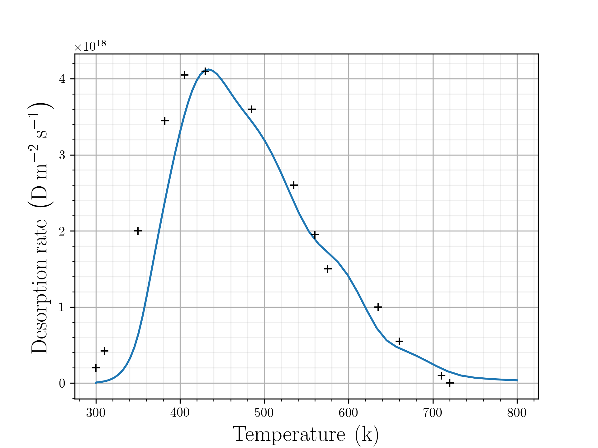

# Thermal Desorption Spectrum 

This more involved example is a key use-case for the code.

This procedure aims to model the experiential work of Ogorodnikova et al. \cite{OGOROD2003}. \\

The original experiment \cite{OGOROD2003} involves a thin tungsten foil $$12 \times 15 \times 0.5 mm^3$$. The foil is exposed to a beam of 200eV deuterium ions during an initial implantation phase which lasts 400s. This is followed by an unspecified resting phase of approximately 5 minutes at a constant temperature of 300K. Finally, the rate of desorption of hydrogen from the foil is measured as the temperature is slowly increased at a constant rate of 8K/s.

 
